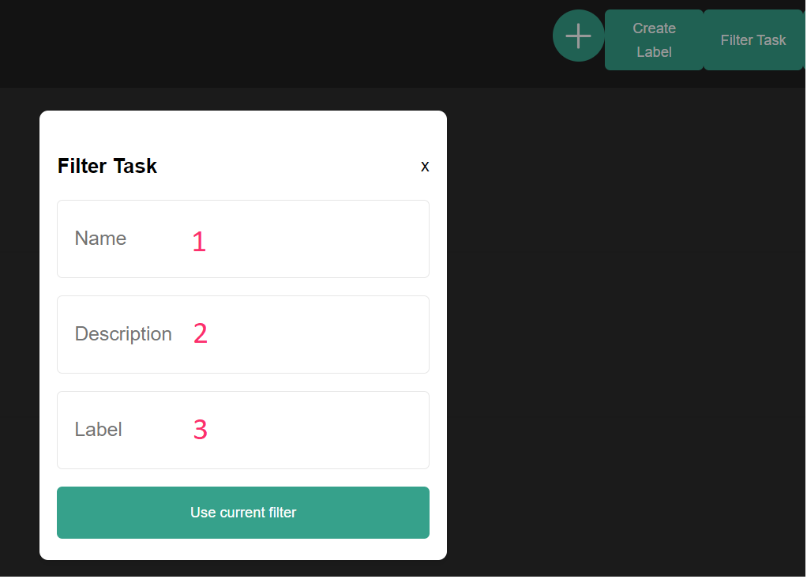

# Frontend

### General Info

To get to the front page type either http://localhost:80 or just **localhost** in the search bar

For the test data you can use **docker-compose exec backend npm run fixtures**

### Dashboard

6. Each task has its own delete button.
7. Starts the timer of specific task

#### 1. Add task form

1. Name must be written in order to create a new task  
2. Description is also required for the task creation
3. Label input is optional. Multiple label input is possible. If you want to input multiple labels then there has to be a comma in between two labels and no blank spaces before or after the comma. Blank space after a label name is only allowed if the label name contains a blank space at the end.   Examples: 
* Label2,Label3
* This is a Label,Label3 

####   2. Create label form

1. Name is required to create a label

####   3. Filter task form

All three options are optional. If neither option is used then all the existing tasks will be shown. If the filter is written wrongly then no tasks will be shown.

####   4. Show labels

After you click on the button, all the existing labels will be shown.

####   5. Delete label form

1. It is possible to delete only one label at a time. Just input the name of the label that you want to delete.

####   Dashboard after starting timer

7. Stops and resets the global timer
8. You have to input tracking description to save the tracking
9. Saves the tracking and stops plus resets the timer.
10. Pauses/Resumes the global timer

####   Taskpage

2 It works exactly like in the dashboard page  
6 Each tracking has its own delete button  
7 Current task

####   1 Edit Task

1. Change task name
2. Change task description
3. Add one or more labels to a task

####   3 Delete label from task

1. It is possible to delete one or more labels from a task at a time.  
If you want to input multiple labels then there has to be a comma in between two labels and no blank spaces before or after the comma. Blank space after a label name is only allowed if the label name contains a blank space at the end.   
Examples: 
* Label2,Label3
* This is a Label,Label3

####   4 Add tracking

1. Description of the tracking

####   5 Edit tracking

1. Change the description of the tracking
2. It is possible to change the start time
3. It is possible to change the end time

---
## Tests

### E2E Tests

Before running tests all the tasks, labels and trackings should be deleted.   
To run e2e tests cd in to the cypress folder in packages cmd and run
 
 * npm install cypress

After the installation

* npm run cypress

####   E2E Tests
